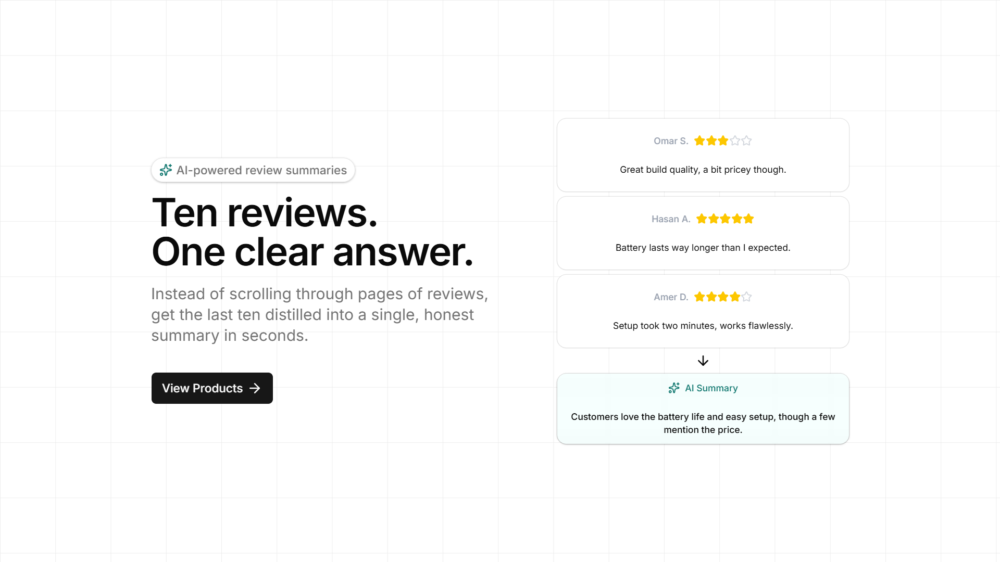
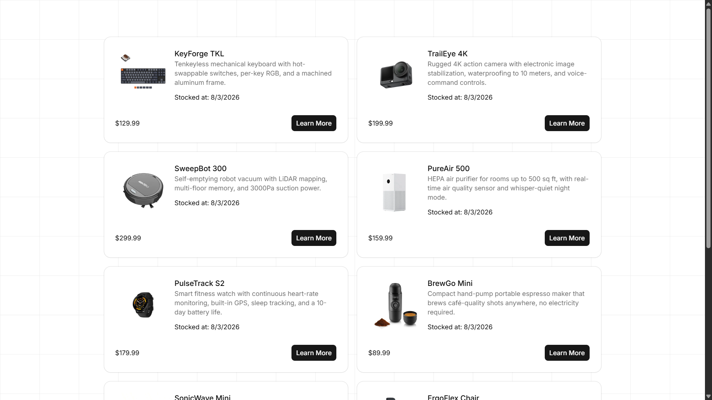
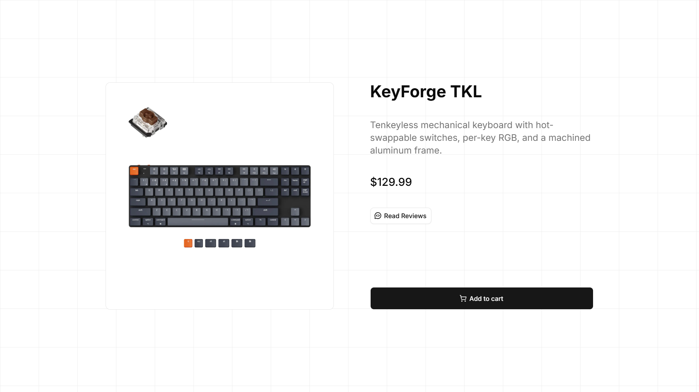
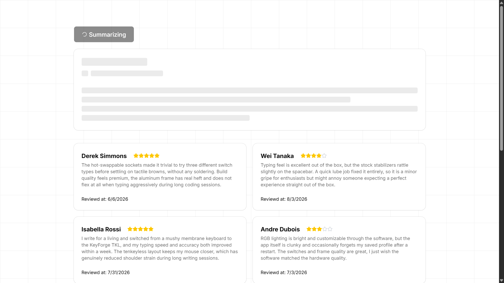
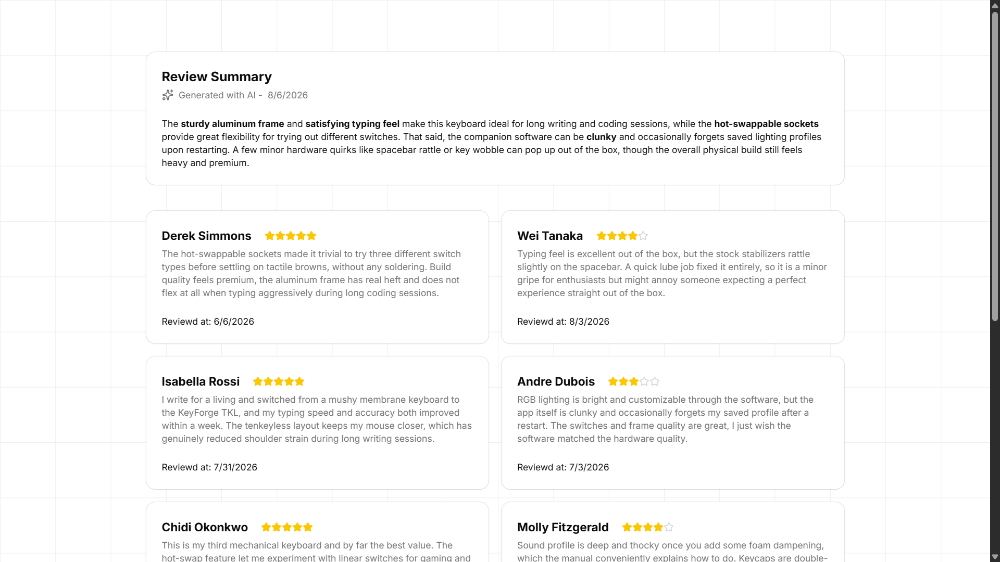

# 🛍️ AI Product Review Synthesizer

> **Stop reading hundreds of reviews. Read what actually matters.**

An AI-powered web application that analyzes customer reviews and generates a concise, structured summary highlighting overall sentiment, recurring strengths, common complaints, and a final buying verdict.

Built with **Next.js**, **Prisma**, **PostgreSQL**, and **Google Gemini**, this project explores how Large Language Models can be integrated into real-world applications while maintaining a responsive user experience.

---

## 📸 Preview







---

# Features

### 🤖 AI-Powered Review Analysis

Generate structured summaries from customer reviews in seconds.

The AI identifies:

* Overall customer sentiment
* Frequently mentioned pros
* Recurring complaints
* Key themes across reviews
* Final purchase recommendation

Instead of displaying another wall of text, the application presents information in a consistent, easy-to-read format.

---

### ⚡ Responsive User Experience

AI responses take time.

To keep the interface responsive, the application includes:

* Skeleton loading states
* Disabled action buttons while generating
* Smooth UI transitions
* Instant visual feedback during processing

---

### 🗂️ Product Catalog

Browse products stored in a PostgreSQL database with:

* Product listing
* Product details
* Customer reviews
* Average ratings
* AI-generated summary

---

### 🗄️ Modern Backend Architecture

The application uses a serverless PostgreSQL database managed through Prisma ORM, providing:

* Type-safe database queries
* Relational data modeling
* Simple migrations
* Excellent developer experience

---

# Tech Stack

| Category         | Technology           |
| ---------------- | -------------------- |
| Framework        | Next.js (App Router) |
| Language         | TypeScript           |
| Styling          | Tailwind CSS         |
| UI Components    | shadcn/ui            |
| Database         | PostgreSQL           |
| ORM              | Prisma               |
| AI               | Google Gemini API    |
| Hosting          | Netlify              |
| Database Hosting | Neon                 |

---

# Architecture

```
User
   │
   ▼
Next.js Frontend
   │
   ├──────────────► PostgreSQL (Neon)
   │                     ▲
   │                     │
   │                 Prisma ORM
   │
   ▼
Google Gemini API
   │
   ▼
Structured Review Summary
```

---

# Engineering Highlights

## Prompt Engineering

One of the biggest challenges when working with LLMs is consistency.

Rather than requesting a generic summary, the application instructs Gemini to generate a predictable structure containing:

* Overall opinion
* Positive highlights
* Negative highlights
* Final verdict

This produces summaries that remain readable regardless of review length or writing quality.

---

## Context Over Individual Ratings

Customer ratings alone rarely tell the full story.

The AI receives both:

* numerical ratings
* review text

This allows it to distinguish between cases such as:

* ⭐⭐⭐⭐⭐ enthusiastic recommendations
* ⭐⭐⭐⭐ mostly positive reviews with minor complaints
* ⭐ reviews describing critical hardware failures

The result is a more balanced summary than averaging ratings alone.

---

## UX During AI Generation

LLM requests introduce unavoidable latency.

Rather than freezing the interface, the application provides continuous feedback through loading states and skeleton placeholders so users always understand what is happening.

---

# Getting Started

## Prerequisites

* Node.js 18+
* PostgreSQL database (or Neon)
* Google Gemini API key

---

## Installation

Clone the repository.

```bash
git clone https://github.com/HasanAlasker/AI-Review-Summarizer.git

cd my-app
```

Install dependencies.

```bash
bun install
```

Create a `.env` file.

```env
see .env.example
```

Push the database schema.

```bash
bunx prisma db push
```

Run the development server.

```bash
bun run dev
```

Visit:

```
http://localhost:3000
```
---

# What I Learned

This project was an opportunity to move beyond simply calling an AI API and focus on building a complete AI-powered feature.

Key takeaways included:

* Integrating LLMs into production-style workflows
* Designing prompts for predictable structured output
* Managing AI latency without hurting UX
* Working with relational data using Prisma
* Building scalable Next.js applications using the App Router

---

<p align="center">
Built with ❤️ using Next.js, Prisma, PostgreSQL, and Google Gemini.
</p>
